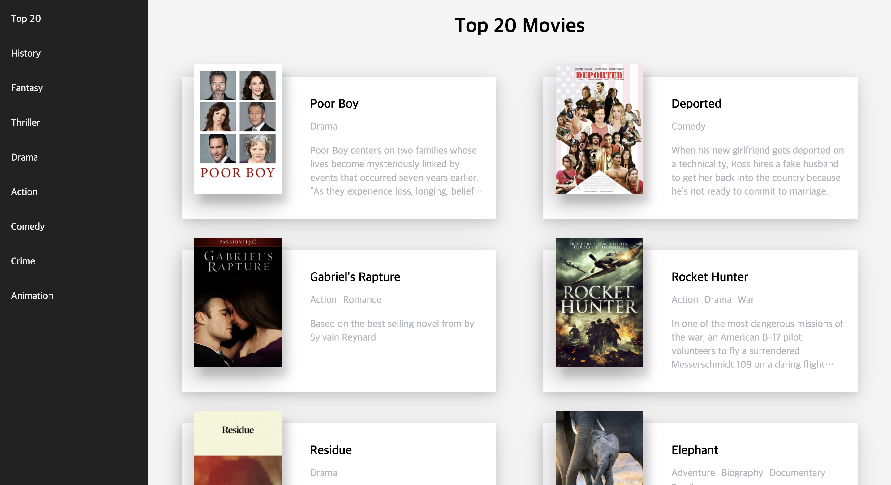

# VanillaJS Single Page Application

> Vanilla.js로 Single Page Application 구조를 구현해봤습니다. <Br/>
> 링크 : [Vanilla Single Page Application](https://www.youtube.com/watch?v=6BozpmSjk-Y&feature=emb_title)

## Installation
```
npm install
```
```
 npm run serve
```

## Description

 **No Framework** <Br/><Br/>
React, Vue를 쓰지 않고 순수 VanillaJS로 SPA 구조를 간단하게 만들었습니다.<br/>
라우터, 컴포넌트, 뷰 등 모든 것을 VanillaJS 로만 구현했습니다.

밑의 이미지는 Open API의 데이터를 렌더링한 결과물입니다.



## 💡 참고 

- https://dev.to/dcodeyt/building-a-single-page-app-without-frameworks-hl9
- https://yts.mx/api (영화 API)
